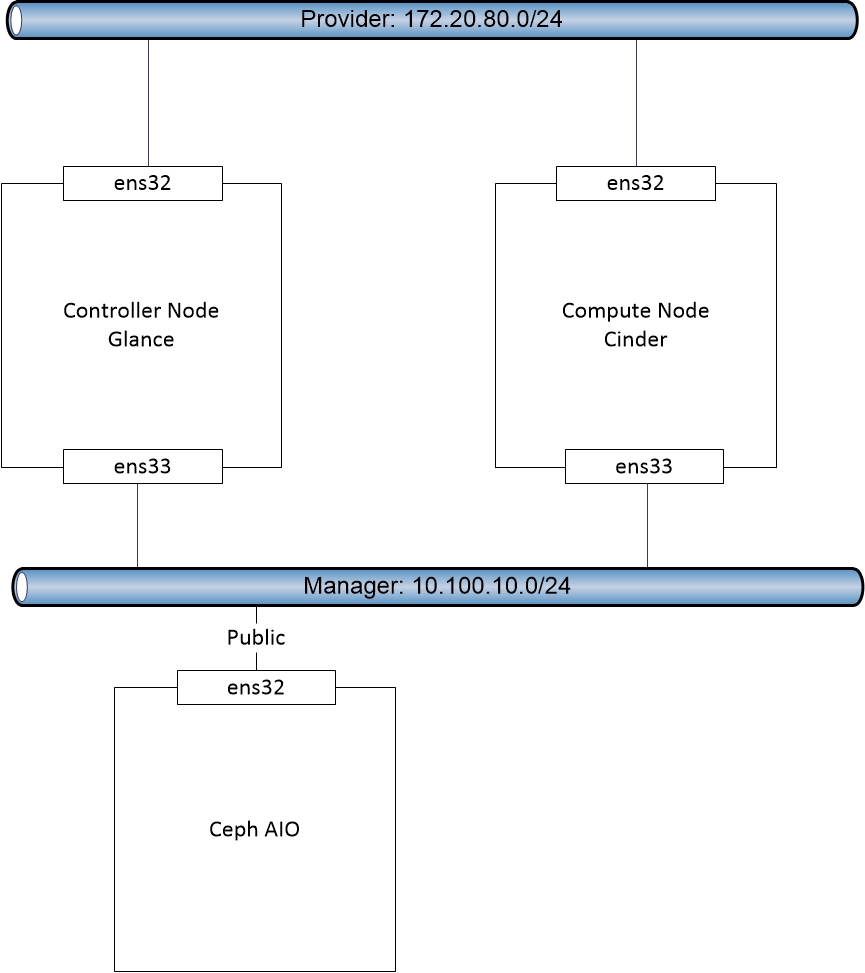

# Hướng dẫn tích hợp Cinder với Ceph

## 1. Mục tiêu LAB
- Hệ thống Ceph sẽ làm backend và cấp phát Block Storage cho dịch vụ Cinder

## 2. Mô hình


## 3. Chuẩn bị môi trường  
- Hệ thống Openstack [Tham khảo](https://github.com/hoangha1908/Openstack/blob/master/README.md)
- Hệ thống Ceph [Tham khảo](https://github.com/hoangha1908/Ceph/blob/master/Deploy_Ceph_AIO.md)
- Tích hợp Glance với Ceph [Tham khảo](https://github.com/hoangha1908/Openstack/blob/master/Glance_with_Ceph.md)
- Lưu ý: Mặt public của hệ thống Ceph phải cùng dải với mặt Manager của Openstack

## 4. Cài đặt
- Lưu ý :
  - Tất cả câu lệnh đều thực hiện với quyền `ROOT`  
- Bước 1 - Compute Node: Chuẩn bị môi trường Ceph
  * yum install  python-rbd ceph-common -y
  * echo -e 'Defaults:cent !requiretty\ncent ALL = (root) NOPASSWD:ALL' | sudo tee /etc/sudoers.d/ceph
  * chmod 440 /etc/sudoers.d/ceph
- Bước 2 - Ceph Node: Tạo pool volumes 
  * ceph osd pool create volumes 128 128
- Bước 3 - Ceph Node: Tạo user volumes, đồng thời gán quyền và tạo file key
  * sudo ceph auth get-or-create client.volumes mon 'allow r' osd 'allow class-read object_prefix rbd_children, allow rwx pool=volumes, allow rx pool=images' -o /etc/ceph/ceph.client.volumes.keyring
- Bước 4 - Ceph Node: Chuyển file config hệ thống Ceph và file key sang Compute Node
  * scp /etc/ceph/ceph.conf root@compute:/etc/ceph/
  * scp /etc/ceph/ceph.client.volumes.keyring root@compute:/etc/ceph/
- Bước 5 - Compute Node: Phân lại quyền cho file key
  * chgrp cinder /etc/ceph/ceph.client.volumes.keyring
  * chmod 0640 /etc/ceph/ceph.client.volumes.keyring
- Bước 6 - Compute Node: Tạo 1 UUID. Mục đích để Nova có thể giao tiếp được với Cinder
  * uuidgen | tee /etc/ceph/cinder.uuid.txt
- Bước 7 - Compute Node: Sửa file config cinder như sau. Lưu ý mục `rbd_secret_uuid` gán giá trị = UUID vừa tạo
  * crudini --set /etc/cinder/cinder.conf DEFAULT	enabled_backends  rbd
  * crudini --set /etc/cinder/cinder.conf rbd	volume_driver  cinder.volume.drivers.rbd.RBDDriver
  * crudini --set /etc/cinder/cinder.conf rbd	rbd_pool  volumes
  * crudini --set /etc/cinder/cinder.conf rbd	rbd_ceph_conf  /etc/ceph/ceph.conf
  * crudini --set /etc/cinder/cinder.conf rbd	rbd_flatten_volume_from_snapshot  false
  * crudini --set /etc/cinder/cinder.conf rbd	rbd_max_clone_depth  5
  * crudini --set /etc/cinder/cinder.conf rbd	rbd_store_chunk_size  4
  * crudini --set /etc/cinder/cinder.conf rbd	rados_connect_timeout  -1
  * crudini --set /etc/cinder/cinder.conf rbd	glance_api_version  2
  * crudini --set /etc/cinder/cinder.conf rbd	rbd_user  volumes
  * crudini --set /etc/cinder/cinder.conf rbd	rbd_secret_uuid  6b36ee8b-a719-4e9f-8c12-ed1d3eaecbab
- Bước 8 - Compute Node: Khai báo user volumes vào file ceph.conf
  * echo "[client.volumes]" >> /etc/ceph/ceph.conf
  * echo "keyring = /etc/ceph/ceph.client.volumes.keyring"  >> /etc/ceph/ceph.conf
- Bước 9 - Compute Node: Restart lại service cinder
  * systemctl restart openstack-cinder-volume.service target.service
- Bước 10 - Ceph Node: Chuyển key của user volumes tới tất cả các Compute Node (Các Node chạy Hypervisor)
  -  ceph auth get-key client.volumes | ssh compute1  tee client.volumes.key
- Bước 11 - Compute Node: Tạo file  `ceph.xml` với nội dung như dưới (cùng thư mục với file key volumes). Lưu ý điền `uuid` cho chuẩn  
```<secret ephemeral="no" private="no">
<uuid>6b36ee8b-a719-4e9f-8c12-ed1d3eaecbab</uuid>
<usage type="ceph">
<name>client.volumes secret</name>
</usage>
</secret>```
- Bước 12 - Compute Node: Thực hiện add key volumes vào Hypervisor. Mục đích để có thể attach `Volumes` vô Instance  
  - virsh secret-define --file ceph.xml
  - virsh secret-set-value --secret 6b36ee8b-a719-4e9f-8c12-ed1d3eaecbab --base64 $(cat client.volumes.key)
 

## Lặp lại bước 11 + 12 trên tất cả các Compute Node trong hệ thống 
 


  
  
  
