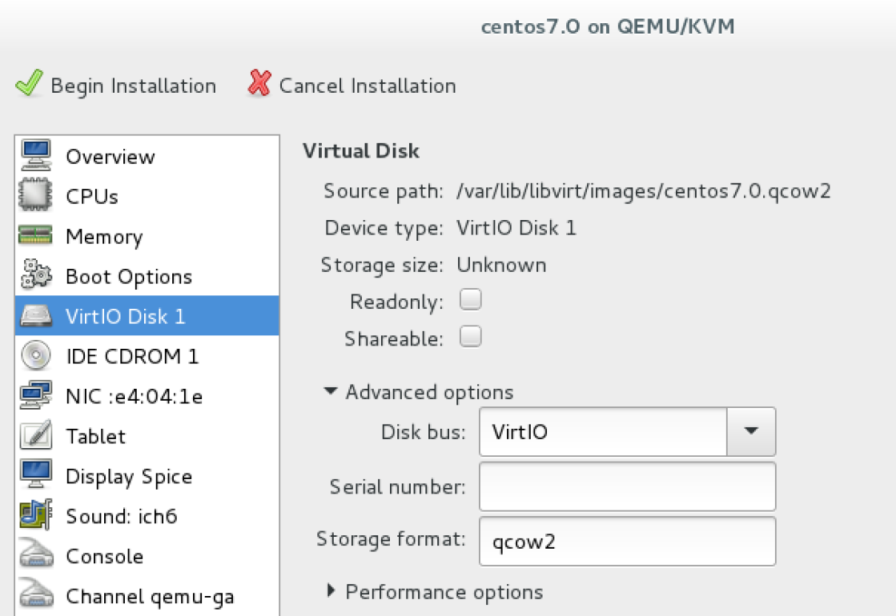
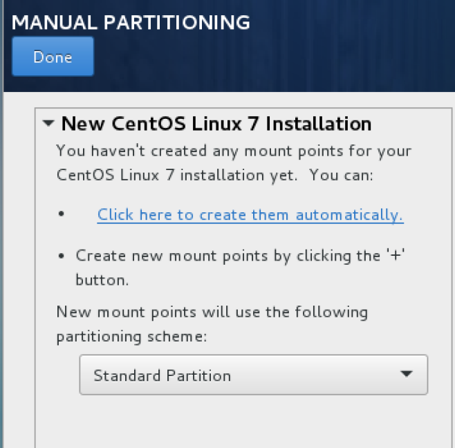
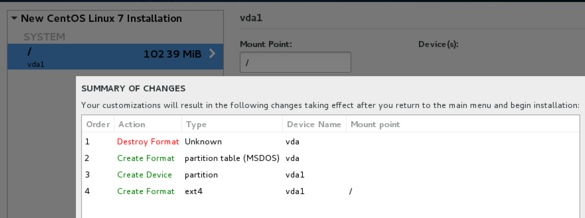
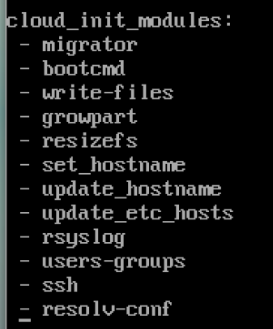
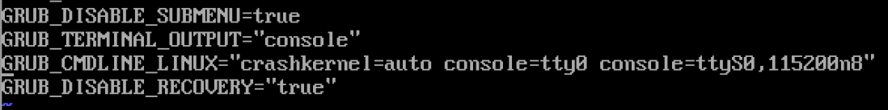

# Hướng dẫn tạo image Centos 7 tương thích với Openstack  

## 1. Mục tiêu LAB
- Tạo hoàn chỉnh file image Centos 7 tương thích hoàn toàn với hệ thống Openstack
- OPS có thể set địa chỉ IP của image
- OPS có thể change hostname của image
- OPS có thể inject ssh key vào user của image
- OPS có thể get log của image
- ... ... ...  

## 2. Chuẩn bị môi trường
- Server KVM [Tham khảo](https://github.com/hoangha1908/Openstack/blob/master/Setup_KVM.md)
- Download file ISO Centos 7 x64 - Minimal và lưu vào thư mục root trên Server KVM [Download](http://mirrors.123host.vn/centos/7/isos/x86_64/CentOS-7-x86_64-Minimal-1611.iso)

## 3. Cài đặt Image
- Bước 1: Khởi động Virtual Manager   
  - applications -> System Tools -> Virtual Machine Manager
- Bước 2: Tiến hành create máy ảo như bình thường  
- 1 số lưu ý khi cài đặt OS  
  - Khi tạo file nhớ kiểm tra định dạng disk là qcow2

  - Đến bước chia phân vùng ổ cứng thì chọn manual và chia toàn bộ dung lượng ổ đĩa vào duy nhất 1 single point là `/` với định dạng ext3 hoặc ext4
  
  
- Bước 3: Sau khi cài đặt OS thành công thì truy cập OS
- Bước 4: Sừa file config card `eth0`, xóa toàn bộ nội dung cũ đi và thay thế như sau  
    DEVICE=eth0  
    BOOTPROTO=dhcp  
    ONBOOT=yes  
    TYPE=Ethernet  
    USERCTL=yes  
    PEERDNS=yes  
    IPV6INIT=no  
    PERSISTENT_DHCLIENT=1  
- Bước 5: Disable firewall, Network manager
  - sudo systemctl disable NetworkManager
  - sudo systemctl disable NetworkManager
  - yum remove postfix NetworkManager NetworkManager-libnm -y
  - systemctl stop firewalld
  - systemctl disable firewalld
   
- Bước 6: Cài đặt các gói cloud
  - yum -y install acpid  cloud-init cloud-utils cloud-utils-growpart vim net-tools wget qemu-guest-agent

- Bước 7: Start Qemu Agent
  - systemctl enable qemu-guest-agent.service
  - systemctl start qemu-guest-agent.service
  
- Bước 8: Thêm vào file `/etc/cloud/cloud.cfg` mục `cloud_init_modules:` dòng  `- resolv-conf`  
  

- Bước 9: Thêm dòng sau vào file network
  - echo "NOZEROCONF=yes" >> /etc/sysconfig/network 

- Bước 10: Để OPS có thể get log từ OS thì sửa file `/etc/default/grub` và thêm `console=tty0 console=ttyS0,115200n8`  
  - GRUB_CMDLINE_LINUX="crashkernel=auto console=tty0 console=ttyS0,115200n8"  
  

- Bước 11: Cập nhật lại grub  và shutdown máy ảo
  - grub2-mkconfig -o /boot/grub2/grub.cfg
  - shutdown -h now
   
- Bước 12: Trên Server KVM tiến hành xóa các thông tin định danh của máy ảo, giả sử máy áo tên là `centos7.0`  
  - virt-sysprep -d centos7.0
  - virsh undefine centos7.0

- Bước 13: Tiến hành giải phóng toàn bộ space rỗng và nén file image lại thành file mới
  - virt-sparsify --compress centos7.0.qcow2 centos7.0_manual.qcow2

- Bước 14: Copy file `centos7.0_manual.qcow2` lên Controller Node và thực hiện import vào Glance bình thường

