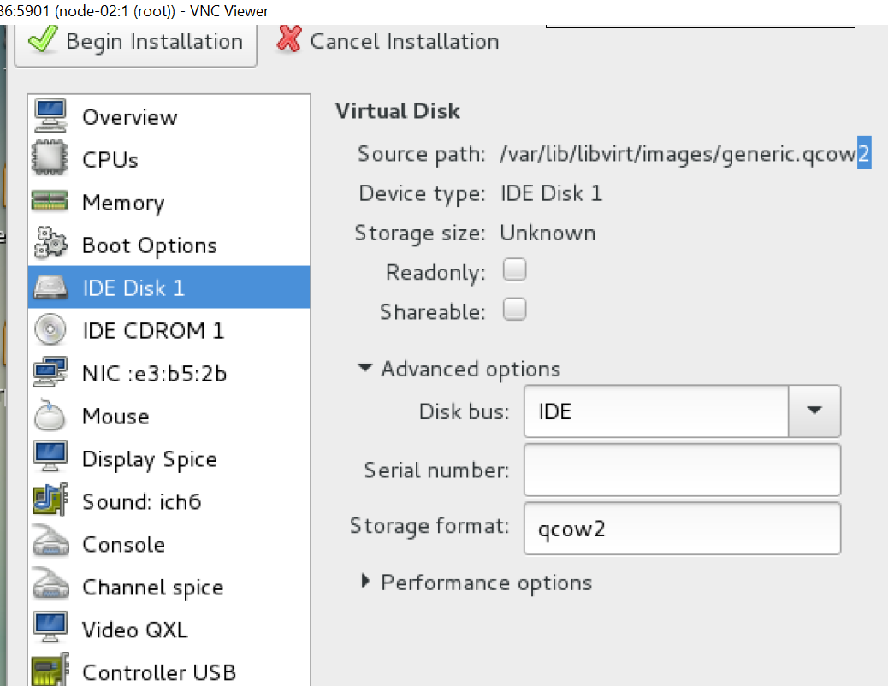
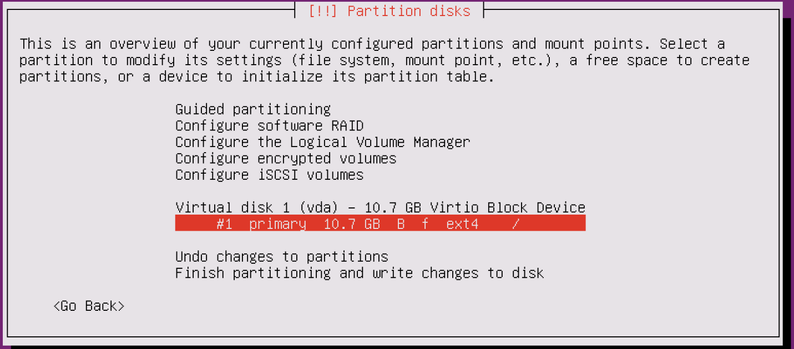
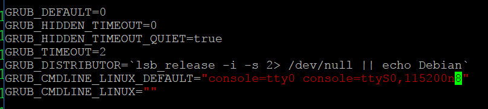

# Hướng dẫn tạo image Ubuntu 16.04 tương thích với Openstack  

## 1. Mục tiêu LAB
- Tạo hoàn chỉnh file image Ubuntu 166.04 tương thích hoàn toàn với hệ thống Openstack
- OPS có thể set địa chỉ IP của image
- OPS có thể change hostname của image
- OPS có thể inject ssh key vào user của image
- OPS có thể get log của image
- ... ... ...  

## 2. Chuẩn bị môi trường
- Server KVM [Tham khảo](https://gitlab.hyperlogy.com/ISS-Hyperlogy/OpenStack/blob/master/Ocata_Script/Setup_KVM.md)
- Download file ISO Ubuntu 16.04 - Server và lưu vào thư mục root trên Server KVM [Download](http://mirrors.nhanhoa.com/ubuntu-releases/16.04.2/ubuntu-16.04.2-server-amd64.iso)

## 3. Cài đặt Image
- Bước 1: Khởi động Virtual Manager   
  - applications -> System Tools -> Virtual Machine Manager
- Bước 2: Tiến hành create máy ảo như bình thường  
- 1 số lưu ý khi cài đặt OS  
  - Khi tạo file nhớ kiểm tra định dạng disk là qcow2

  - Đến bước chia phân vùng ổ cứng thì chọn manual và chia toàn bộ dung lượng ổ đĩa vào duy nhất 1 single point là `/` với định dạng ext3 hoặc ext4
  
- Bước 3: Sau khi cài đặt OS thành công thì truy cập OS

- Bước 4: Cài đặt các gói cloud
  - apt-get install cloud-init  cloud-utils -y

- Bước 5: Để OPS có thể get log từ OS thì sửa file `/etc/default/grub` và thêm `console=tty0 console=ttyS0,115200n8`  
  - GRUB_CMDLINE_LINUX_DEFAULT="console=tty0 console=ttyS0,115200n8"
  

- Bước 6: Cập nhật lại grub  và shutdown máy ảo
  - update-grub
  - shutdown -h now
   
- Bước 7: Trên Server KVM tiến hành loại bỏ máy ảo Ubuntu ra , giả sử máy ảo tên là `ubuntu16.04`  
   - virsh undefine ubuntu16.04

- Bước 8: Tiến hành giải phóng toàn bộ space rỗng và nén file image lại thành file mới
  - virt-sparsify --compress ubuntu16.04.qcow2 ubuntu16.04_manual.qcow2

- Bước 9: Copy file `ubuntu16.04_manual.qcow2` lên Controller Node và thực hiện import vào Glance bình thường

