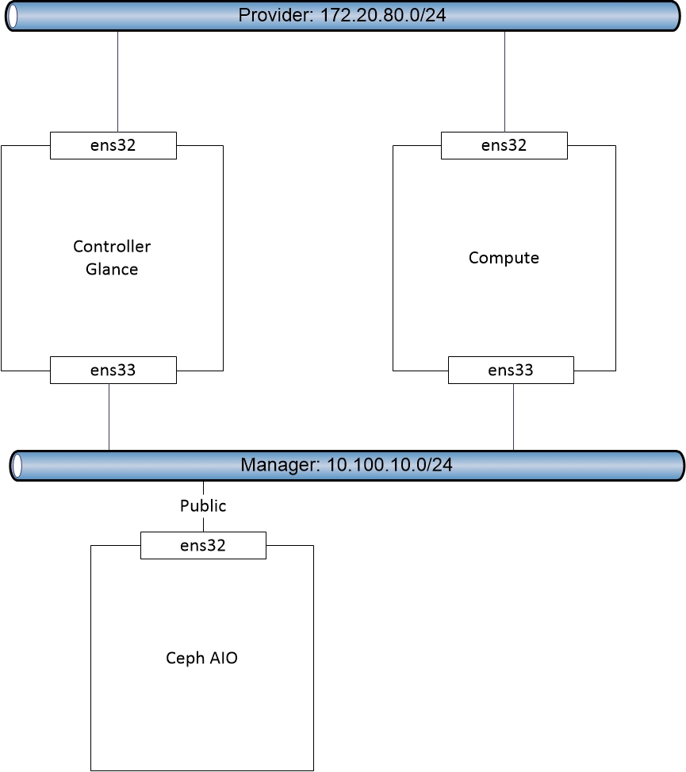

# Hướng dẫn tích hợp Glance với Ceph

## 1. Mục tiêu LAB
- Hệ thống Ceph sẽ làm backend và cấp phát Block Storage cho dịch vụ Glance

## 2. Mô hình

## 3. Chuẩn bị môi trường  
- Hệ thống Openstack [Tham khảo](https://github.com/hoangha1908/Openstack/blob/master/README.md)
- Hệ thống Ceph [Tham khảo](https://gitlab.hyperlogy.com/ISS-Hyperlogy/Ceph/blob/master/Docs/Deploy_Ceph_AIO.md)
- Lưu ý: Mặt public của hệ thống Ceph phải cùng dải với mặt Manager của Openstack

## 4. Cài đặt
- Lưu ý :
  - Tất cả câu lệnh đều thực hiện với quyền `ROOT`  
- Bước 1 - Controller Node: Chuẩn bị môi trường Ceph
  * yum install  python-rbd ceph-common -y
  * echo -e 'Defaults:cent !requiretty\ncent ALL = (root) NOPASSWD:ALL' | sudo tee /etc/sudoers.d/ceph
  * chmod 440 /etc/sudoers.d/ceph
- Bước 2 - Ceph Node: Tạo pool images 
  * ceph osd pool create images 128 128
- Bước 3 - Ceph Node: Tạo user images, đồng thời gán quyền và tạo file key
  * sudo ceph auth get-or-create client.images mon 'allow r' osd 'allow class-read object_prefix rbd_children, allow rwx pool=images' -o /etc/ceph/ceph.client.images.keyring
- Bước 4 - Ceph Node: Chuyển file config hệ thống Ceph và file key sang Controller Node
  * scp /etc/ceph/ceph.conf root@controller:/etc/ceph/
  * ceph auth get-or-create client.images | ssh controller  sudo tee /etc/ceph/ceph.client.images.keyring
- Bước 5 - Controller Node: Phân lại quyền cho file key
  * chown glance:glance /etc/ceph/ceph.client.images.keyring
  * chmod 0640 /etc/ceph/ceph.client.images.keyring
- Bước 6 - Controller Node: Sửa file config glance-api như sau
  * crudini --set /etc/glance/glance-api.conf DEFAULT show_image_direct_url True
  * crudini --set /etc/glance/glance-api.conf DEFAULT show_multiple_locations True
  * crudini --set /etc/glance/glance-api.conf glance_store stores glance.store.rbd.Store
  * crudini --set /etc/glance/glance-api.conf glance_store default_store rbd
  * crudini --set /etc/glance/glance-api.conf glance_store rbd_store_pool images
  * crudini --set /etc/glance/glance-api.conf glance_store rbd_store_user images
  * crudini --set /etc/glance/glance-api.conf glance_store rbd_store_ceph_conf /etc/ceph/ceph.conf
- Bước 7 - Controller Node: Khai báo user images vào file ceph.conf
  * echo "[client.images]" >> /etc/ceph/ceph.conf
  * echo "keyring = /etc/ceph/ceph.client.images.keyring"  >> /etc/ceph/ceph.conf
- Bước 8 - Controller Node: Restart lại glance api
  * systemctl restart openstack-glance-api.service
   
  
  
  
