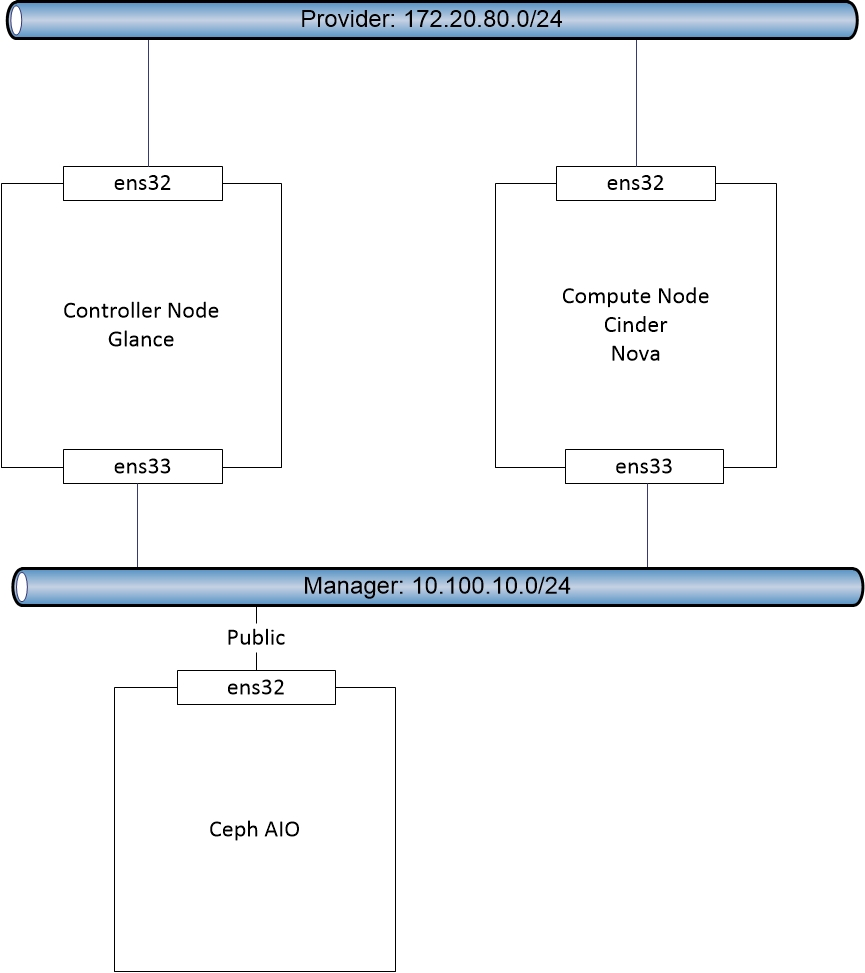

# Hướng dẫn tích hợp Nova với Ceph

## 1. Mục tiêu LAB
- Hệ thống Ceph sẽ làm backend và cấp phát Block Storage cho dịch vụ Nova

## 2. Mô hình


## 3. Chuẩn bị môi trường  
- Hệ thống Openstack [Tham khảo](https://gitlab.hyperlogy.com/ISS-Hyperlogy/OpenStack/blob/master/Ocata_Script/README.md)
- Hệ thống Ceph [Tham khảo](https://gitlab.hyperlogy.com/ISS-Hyperlogy/Ceph/blob/master/Docs/Deploy_Ceph_AIO.md)
- Tích hợp Glance với Ceph [Tham khảo](https://gitlab.hyperlogy.com/ISS-Hyperlogy/OpenStack/blob/master/Ocata_Script/Glance_with_Ceph.md)
- Tích hợp Cinder với Ceph [Tham khảo](https://gitlab.hyperlogy.com/ISS-Hyperlogy/OpenStack/blob/master/Ocata_Script/Cinder_with_Ceph.md)
- Lưu ý: Mặt public của hệ thống Ceph phải cùng dải với mặt Manager của Openstack

## 4. Cài đặt
- Lưu ý :
  - Tất cả câu lệnh đều thực hiện với quyền `ROOT`  
- Bước 1 - Compute Node: Chuẩn bị môi trường Ceph
  * yum install  python-rbd ceph-common -y
  * mkdir /etc/ceph
  * useradd ceph
  * passwd ceph
  * echo -e 'Defaults:cent !requiretty\ncent ALL = (root) NOPASSWD:ALL' | sudo tee /etc/sudoers.d/ceph
  * chmod 440 /etc/sudoers.d/ceph
- Bước 2 - Ceph Node: Tạo pool vms  
  * ceph osd pool create vms  128 128
- Bước 3 - Ceph Node: Tạo user nova, đồng thời gán quyền và tạo file key
  * sudo ceph auth get-or-create client.nova mon 'allow r' osd 'allow class-read object_prefix rbd_children, allow rwx pool=vms, allow rwx pool=volumes, allow rx pool=images' -o /etc/ceph/ceph.client.nova.keyring
- Bước 4 - Ceph Node: Chuyển file config hệ thống Ceph và file key sang Compute Node (Nếu có nhiều Compute thì lặp lại)
  * scp /etc/ceph/ceph.conf root@compute:/etc/ceph/
  * scp /etc/ceph/ceph.client.nova.keyring root@compute:/etc/ceph
- Bước 5 - Compute Node: Phân lại quyền cho file key
  * chgrp nova /etc/ceph/ceph.client.nova.keyring
  * chmod 0640 /etc/ceph/ceph.client.nova.keyring
- Bước 6 - Compute Node: Tạo 1 UUID. Mục đích để libvirt có thể giao tiếp được với Ceph
  * uuidgen |tee /etc/ceph/nova.uuid.txt
- Bước 7 - Compute Node: Sửa file config nova như sau. Lưu ý mục `rbd_secret_uuid` gán giá trị = UUID vừa tạo
  * crudini --set  /etc/nova/nova.conf DEFAULT	force_raw_images    True
  * crudini --set  /etc/nova/nova.conf DEFAULT	disk_cachemodes    writeback
  * crudini --set  /etc/nova/nova.conf libvirt	images_rbd_pool  vms
  * crudini --set  /etc/nova/nova.conf libvirt	images_type  rbd
  * crudini --set  /etc/nova/nova.conf libvirt	images_rbd_ceph_conf  /etc/ceph/ceph.conf
  * crudini --set  /etc/nova/nova.conf libvirt	rbd_secret_uuid ac2419d8-5eed-4ff4-a78b-cf18805b0432
  * crudini --set  /etc/nova/nova.conf libvirt	rbd_user  nova
- Bước 7 - Compute Node: Khai báo user nova vào file ceph.conf
  * echo "[client.nova]" >> /etc/ceph/ceph.conf
  * echo "keyring = /etc/ceph/ceph.client.nova.keyring"  >> /etc/ceph/ceph.conf
- Bước 8 - Compute Node: Restart lại service nova
  * systemctl restart openstack-nova-compute.service
- Bước 9 - Ceph Node: Chuyển key của user nova tới tất cả các Compute Node (Các Node chạy Hypervisor)
  - sudo ceph auth get-key client.nova | ssh compute tee client.nova.key
- Bước 10 - Compute Node: Tạo file  `ceph.xml` với nội dung như dưới (cùng thư mục với file key nova). Lưu ý điền `uuid` cho chuẩn  
```<secret ephemeral="no" private="no">
<uuid>ac2419d8-5eed-4ff4-a78b-cf18805b0432</uuid>
<usage type="ceph">
<name>client.nova  secret</name>
</usage>
</secret>```
- Bước 11 - Compute Node: Thực hiện add key nova vào Hypervisor. Mục đích để libvirt có thể giao tiếp được với Ceph
  - virsh secret-define --file ceph.xml
  - virsh secret-set-value --secret ac2419d8-5eed-4ff4-a78b-cf18805b0432 --base64 $(cat client.nova.key)
 

## Lặp lại từ bước 5 đến 11 trên tất cả các Compute Node trong hệ thống 
 


  
  
  