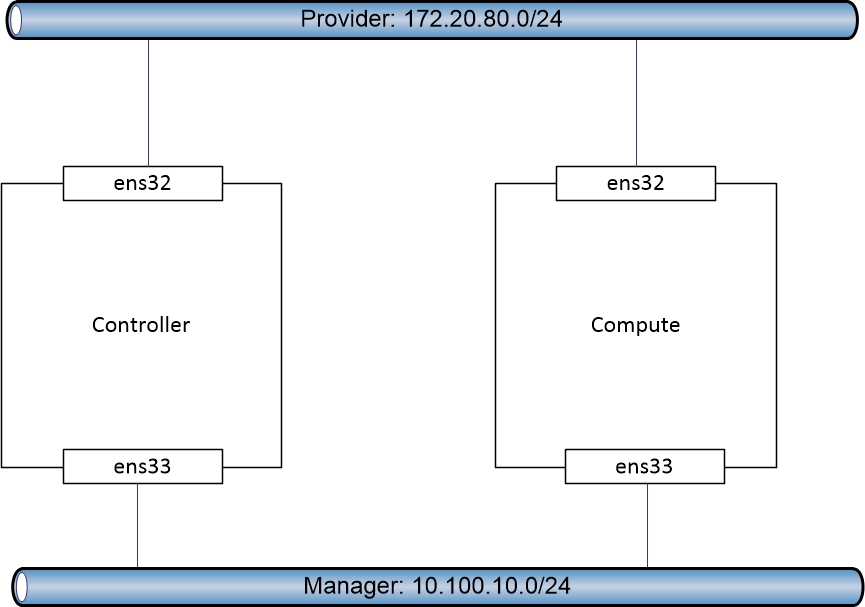

# Hướng dẫn cài đặt OPENSTACK OCATA sử dụng `script` trên 2 Node

## 1. Mục tiêu LAB
- Triển khai thành công Openstack phiên bản Ocata trên Centos  
- Mô hình này sẽ cài các thành phần Service CORE của OPS bao gồm:
  - Controller
    * Chrony
    * RabbitMQ
    * Memcached
    * Keystone
    * Glance
    * Nova
    * Neutron
    * Horizone
  - Compute
    * Chrony
    * Nova
    * Neutron
- Mô hình này sẽ sử dụng Network với kiến trúc Provider

## 2. Mô hình 


## 3. Chuẩn bị môi trường LAB 
- Hardware Min: 4 CPU, 8GB RAM, 50GB HDD
- OS
  - CentOS Server 7.3 64 bit
  - 02 NICs: 
    - `ens32`: dùng để ssh và tải gói cho máy chủ, các Instance cũng đi ra internet theo đường này, sử dụng dải 172.20.80.0/24
    - `ens33`: dùng để các Service giao tiếp với nhau, sử dụng dải 10.100.10.0/24
- Tải toàn bộ file script trong repo này xuống cả 2 node (Ae tự làm nhé)

## 4. Cài đặt theo đúng thứ tự các bước sau
- Lưu ý :
  - Tất cả câu lệnh đều thực hiện với quyền `ROOT`  
  - Thực hiện tại thư mục /root (Mặc định khi đăng nhập)

- Bước 1 - Controller Node:
  * Mở file environment_controller.sh và sửa các tham số sau cho chuẩn môi trường  
    - IP_PROVIDER, PREFIX_PROVIDER, GATEWAY, INTERFACE_NAME_PROVIDER: Thông tin card Provider  
    - IP_MANAGER, PREFIX_MANAGER, INTERFACE_NAME_MANAGER: Thông tin card Manager  
    - PW_DB: Mật khẩu truy cập Databasse, chung cho toàn bộ Service  
    - PW_SV: Mật khẩu truy cập Service, chung cho toàn bộ Service  
    - PW_MQ: Mật khẩu truy cập Username 'openstack' thuộc Service RabbitMQ
  
- Bước 2 - Controller Node: Tiến hành setup môi trường. Sẽ tự động `Reboot` khi setup xong
  ```
  sh environment_controller.sh
  ```
  
  
  
- Bước 3 - Controller Node: Ssh lại và tiến hành cài đặt Keystone
   ```
  sh keystone_controller.sh    
  ```

- Bước 4 - Controller Node: Tiến hành cài đặt Glance
  ```
  sh glance_controller.sh    
  ```
  
- Bước 5 - Controller Node: Tiến hành cài đặt Nova
  ```
  sh nova_controller.sh    
  ```
- Bước 6 - Compute Node
  * Mở file environment_compute.sh và sửa các tham số sau cho chuẩn môi trường  
    - IP_PROVIDER, PREFIX_PROVIDER, GATEWAY, INTERFACE_NAME_PROVIDER: Thông tin card Provider  
    - IP_MANAGER, PREFIX_MANAGER, INTERFACE_NAME_MANAGER: Thông tin card Manager  
    - IP_MANAGER_CONTROLLER: Địa chỉ IP card Manager của Controller
    - IP_PROVIDER_MANAGER: Địa chỉ IP card Provider của Controller
    - PW_DB: Mật khẩu truy cập Databasse, chung cho toàn bộ Service  
    - PW_SV: Mật khẩu truy cập Service, chung cho toàn bộ Service  
    - PW_MQ: Mật khẩu truy cập Username 'openstack' thuộc Service RabbitMQ
    
- Bước 7 - Compute Node: Tiến hành setup môi trường. Sẽ tự động `Reboot` khi setup xong
  ```
  sh environment_compute.sh    
  ```
- Bước 8 - Compute Node: Ssh lại và tiến hành cài đặt Nova
  ```
  sh nova_compute.sh    
  ```
- Bước 9 - Controller Node: Tiến hành add host Compute vào hệ thống
  ```
  sh add_compute_node.sh    
  ```
- Bước 10 - Controller Node: Tiến hành cài đặt Neutron
  ```
  sh neutron_controller.sh    
  ```
- Bước 11 - Compute Node: Tiến hành cài đặt Neutron
  ```
  sh neutron_compute.sh    
  ```
- Bước 12 - Controller Node: Tiến hành cài đặt Horizon
  ```
  sh horizone_controller.sh    
  ```
- Bước 13 - Controller Node: Verify lại toàn bộ dịch vụ
  ```
  sh verify_controller.sh    
  ```
 
- Bước 14: Truy cập Horizon: 
   * http://IP_PROVIDER_MANAGER/dashboard
   * Tài khoản đăng nhập: admin/$PW_SV  
- Bước 15: Tạo Instance ([Chi tiết](https://docs.openstack.org/ocata/install-guide-rdo/launch-instance.html))
   * Tạo Virutal Network
   * Tạo subnet cho Network
   * Tạo một flavor
   * Tạo keypair
   * Add rule cho phép ping, ssh 
   * Tạo 1 insntace với các lựa chọn trên
