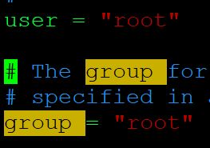
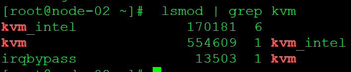
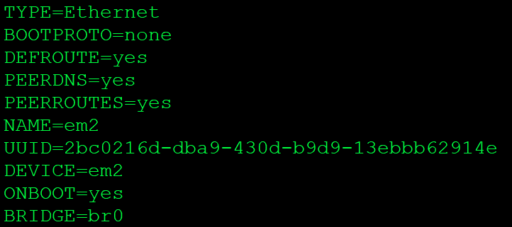
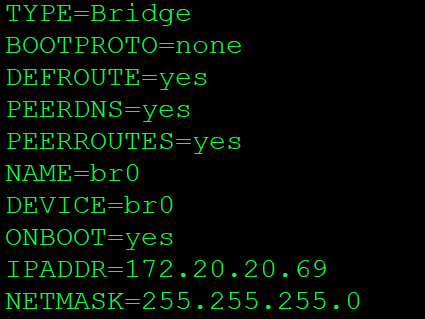
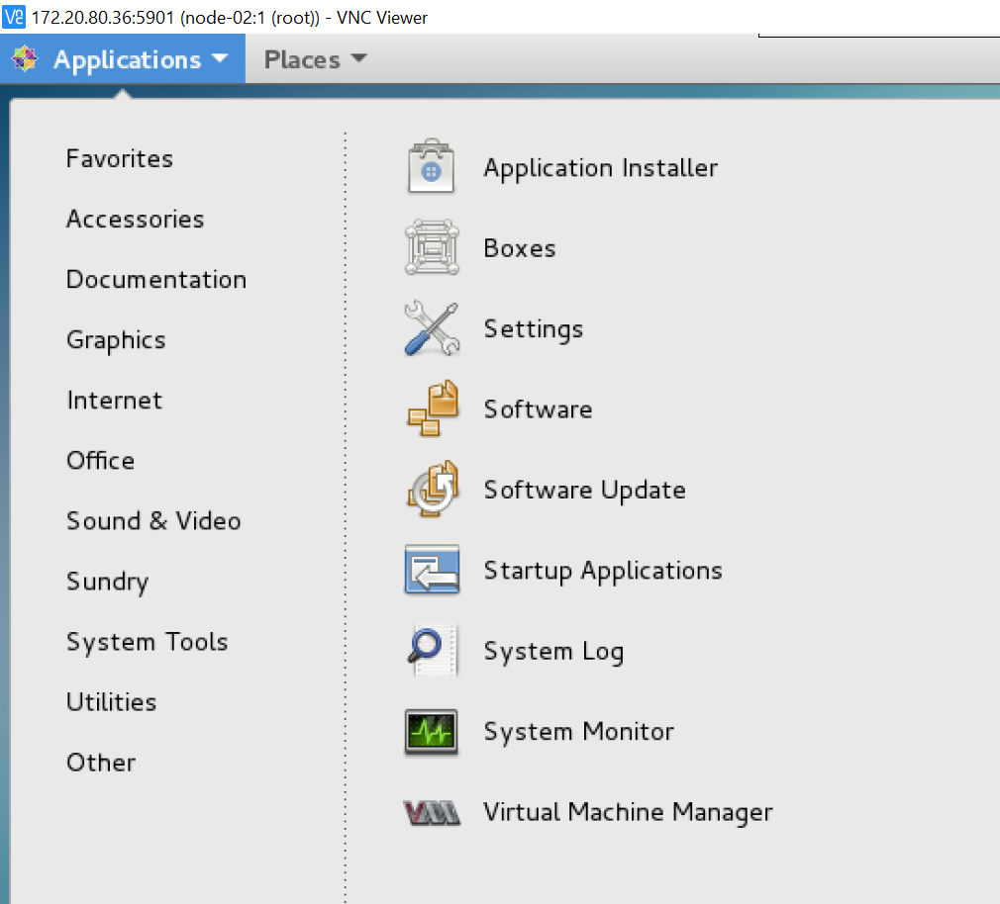
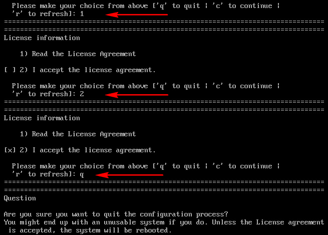

# Hướng dẫn cài đặt Hypervisor KVM trên Centos

## 1. Mục tiêu LAB
- Cài đặt được thành phần Hypervisor KVM và công cụ quản lý Virtual Machine Manager
- Thực hiện remote từ xa vào Server KVM thông qua giao diện đồ họa là TigerVNC

## 2. Chuẩn bị môi trường
- OS
  - CentOS Server 7.3 64 bit
  - 01: HDD dung lượng càng cao càng tốt
  - CPU, RAM càng cao càng tốt
  - 01 NIC: 
    - `ens32`: đi ra internet được, dùng để tải phần mềm  

## 3. Cài đặt TigerVNC
- Bước 1: Cài đặt môi trường đồ họa cho server (Nếu đã có thì không cần thực hiện bước này)  

   - yum groupinstall "GNOME Desktop" -y  
   
- Bước 2: Cài đặt TigerVNC Server
  ```
yum install tigervnc-server -y
  ```
- Bước 3: Copy thêm 1 file config từ file config gốc của VNC  
  ```
  cp /lib/systemd/system/vncserver@.service /etc/systemd/system/vncserver@:1.service
  ```
- Bước 4: Sửa file vncserver@:1.service. Giả sử ta muốn login vào bằng tài khoản `root`, sửa trong `[Service]`  
  ```
[Service]
Type=forking
# Clean any existing files in /tmp/.X11-unix environment
ExecStartPre=/bin/sh -c '/usr/bin/vncserver -kill %i > /dev/null 2>&1 || :'
ExecStart=/usr/sbin/runuser -l root -c "/usr/bin/vncserver %i"
PIDFile=/root/.vnc/%H%i.pid
ExecStop=/bin/sh -c '/usr/bin/vncserver -kill %i > /dev/null 2>&1 || :'
  ```
- Bước 5: Tắt firewall
  ```sh
sudo systemctl disable firewalld
sudo systemctl stop firewalld
  ```
  
- Bước 6: Đặt pass VNC cho tài khoản root
  ```sh
vncserver
  ```
- Bước 7: Start service cùng OS
  ```sh
  systemctl daemon-reload
systemctl enable vncserver@:1.service
systemctl start vncserver@:1.service
  ```

- Bước 8: Cài đặt các gói KVM
  ```sh
   yum install qemu-kvm qemu-img virt-manager libvirt libvirt-python libvirt-client virt-install virt-viewer bridge-utils -y
   yum install /usr/bin/virt-sysprep
   ```  
- Bước 9: Sửa file /etc/libvirt/qemu.conf và thêm `user` và `group` = root  


- Bước 10: Start service libvirtd
  ```sh
  - systemctl start libvirtd
  - systemctl enable libvirtd
   ```  
- Bước 11: Kiểm tra lại bằng lệnh ` lsmod | grep kvm`  


- Bước 12: Chuyển card mạng sang chế độ Bridge. Chuyển `em2` sang card ảo `br0`  


- Bước 13: Copy file config card `em2` và đổi tên thành `br0`
  ```sh
   cp /etc/sysconfig/network-scripts/ifcfg-em2 /etc/sysconfig/network-scripts/ifcfg-br0
   ```
- Bước 14: Sửa file config `br0`, xóa UUID và sửa cho đúng như sau  
 

- Bước 15: Restart lại các card mạng
  ```sh 
  /etc/init.d/network restart
   ```
- Bước 16: Trên Windows cài phần mềm VNC Viewer
  - Kết nối tới VNC Server qua IP:5901  và nhập mật khẩu đã tạo ở trên  


- Bước 17: Khởi động Virtual Machine Manager



- Lưu ý
  - Khi reboot nếu gặp lỗi Lisence GNOME thì thực hiện ấn theo thứ tự sau 1 -> 2 -> q  
 