# Hướng dẫn tạo image Windows Server 2012  tương thích với Openstack  

## 1. Mục tiêu LAB
- Tạo hoàn chỉnh file image Windows Server 2012 tương thích hoàn toàn với hệ thống Openstack
- OPS có thể set địa chỉ IP của image
- OPS có thể change hostname của image
- OPS có thể get log của image
- ... ... ...  

## 2. Chuẩn bị môi trường
- Server KVM [Tham khảo](https://gitlab.hyperlogy.com/ISS-Hyperlogy/OpenStack/blob/master/Ocata_Script/Setup_KVM.md)
- Download file ISO Windows Server 2012 x64 và lưu vào thư mục root trên Server KVM
- Download Virtio-Win và lưu vào thư mục root trên Server KVM [Downnload](https://fedorapeople.org/groups/virt/virtio-win/direct-downloads/stable-virtio/virtio-win.iso)

## 3. Cài đặt Image
- Bước 1: Tạo file Qcow2    
  - qemu-img create -f qcow2 ws2012.qcow2 15G
- Bước 2: Start máy ảo Win với Virt-install  
  - virt-install --connect qemu:///system   -n ws2012.qcow2 -r 5000 --vcpus=6   --network network=default,model=virtio  \     
    --disk path=ws2012.qcow2,format=qcow2,size=20,device=disk,bus=virtio \    
    --cdrom /home/SW_DVD9_Windows_Svr_Std_and_DataCtr_2012_R2_64Bit_English_-2_Core_MLF_X19-31419.ISO    
    --disk path=/home/virtio-win.iso,device=cdrom   
    --vnc --os-type windows --os-variant win2k12r
- Lưu ý: Trỏ đúng vị trí các thông tin file, sau khi Start truy cập giao diện Virt-manager để tiếp tục cài
  - Vị trí file QCOW2, file ISO, file Virtio
- Bước 3: Hoặc tạo thông tin máy ảo dùng Virt-manager như sau
  - Khi tạo file nhớ kiểm tra định dạng disk là qcow2
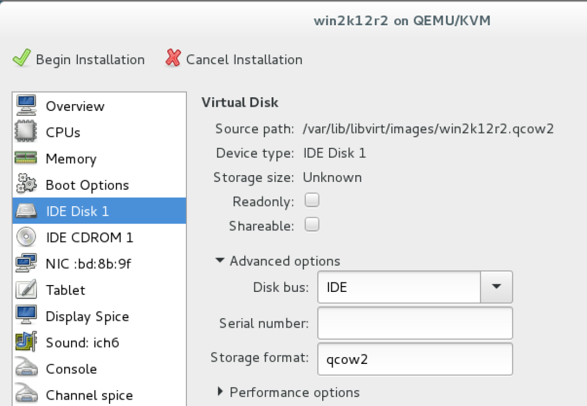
  - Link tới file ISO Windows
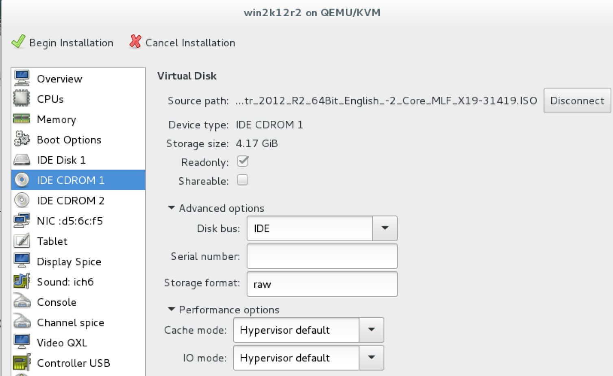
  - Link tới file ISO Virtio
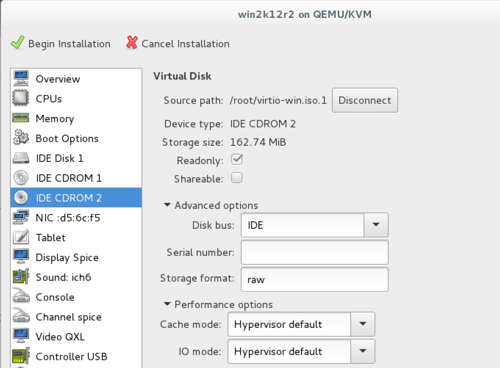
  - Thay đổi thứ tự boot
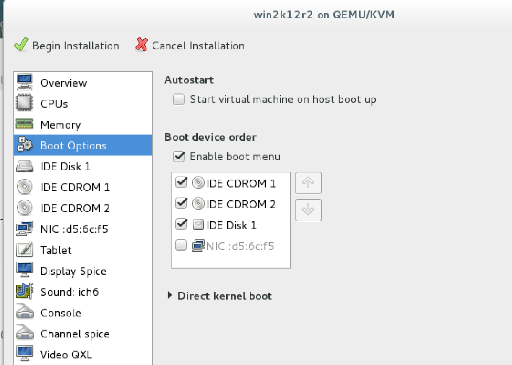
  - Network chế độ virtio
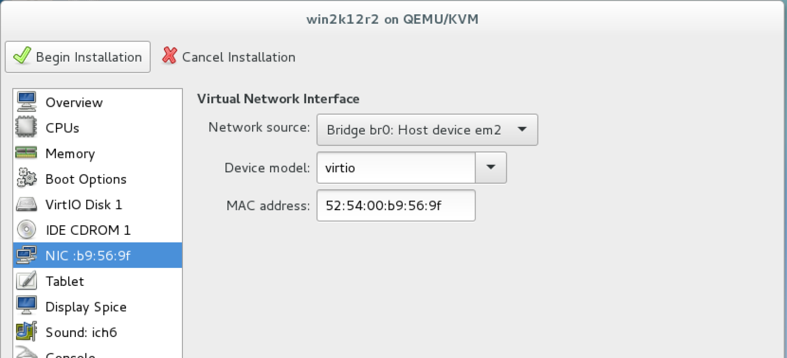
- Bước 4: Bắt đầu cài đặt như bình thường
  - Tuy nhiên, OS sẽ không detect được ổ cứng. Chọn Load Driver `VirtIO SCSI` trong đường dẫn `E:\virtio-win-0.1XX\viostor\2k12r2\amd64`
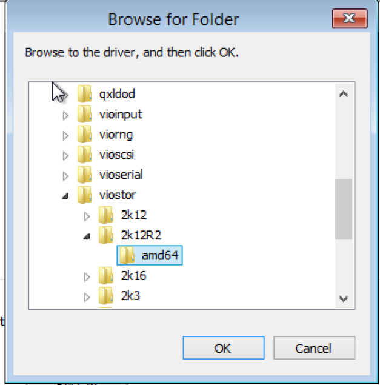
- Bước 5: Tiến hành cài đặt OS Windows như bình thường
- Bước 6: Log in Administrator mở CMD thực hiện load driver cần thiết
  - pnputil -i -a D:\NetKVM\2k12R2\amd64\*.INF
  - pnputil -i -a D:\Balloon\2k12R2\amd64\*.INF
  - DISM /Online /Enable-Feature /FeatureName:NetFx3 /All /LimitAccess /Source:D:\SOURCES\SXS
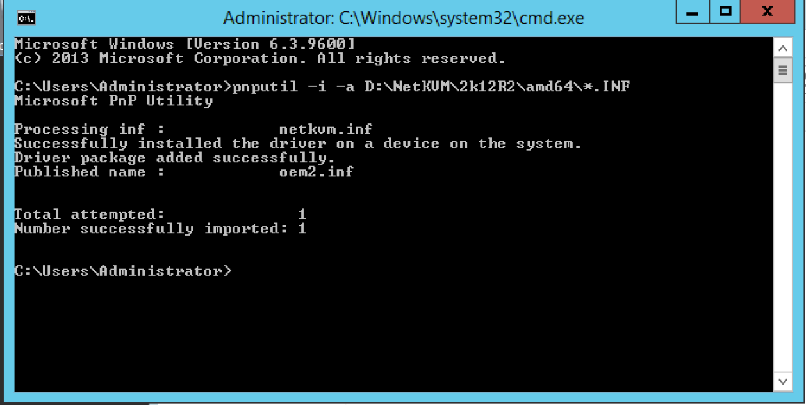
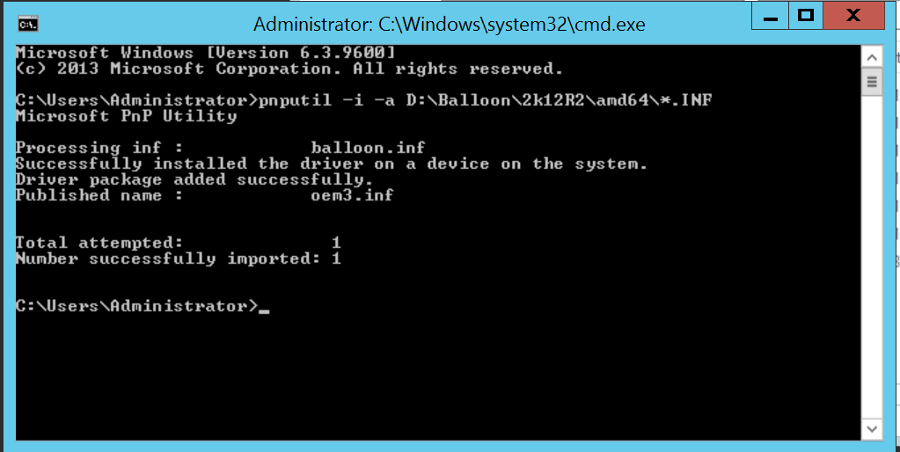
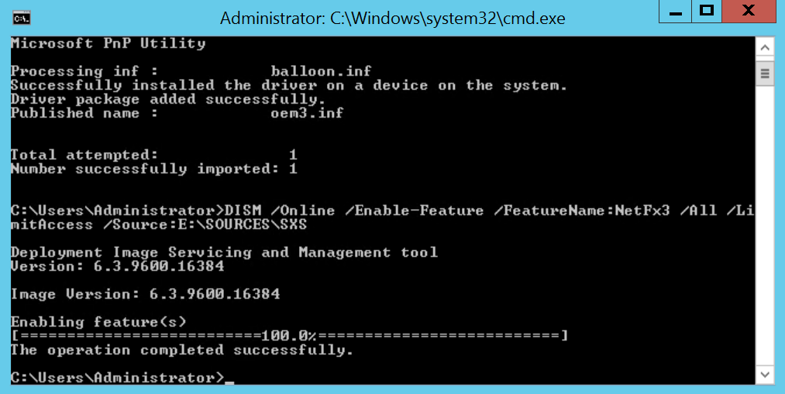
- Bước 6 : Tải phần mềm `Cloud-init` và khởi chạy
  - powershell
  - Set-ExecutionPolicy Unrestricted
  - Invoke-WebRequest -UseBasicParsing https://cloudbase.it/downloads/CloudbaseInitSetup_Stable_x64.msi -OutFile cloudbaseinit.msi
  - .\cloudbaseinit.msi
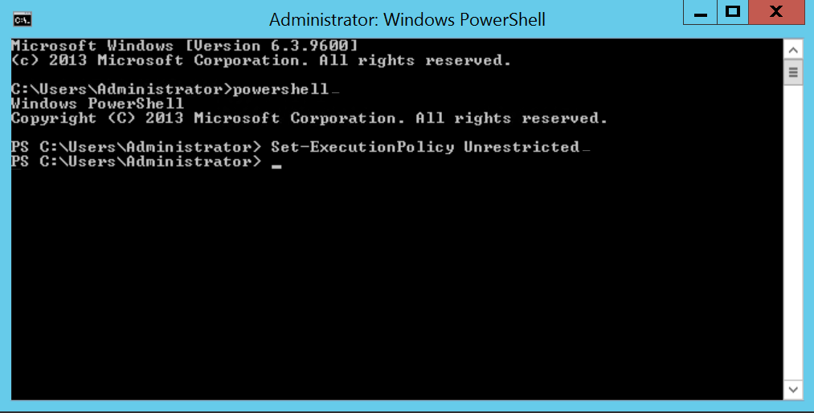
- Bước 7: Khi cửa sổ cấu hình `Cloud-init` hiện lên thì điền tham số
  - Username: Administrator
  - Serial port for logging: COM1
  - Tích chọn Run Cloudbase-Init service as LocalSystem
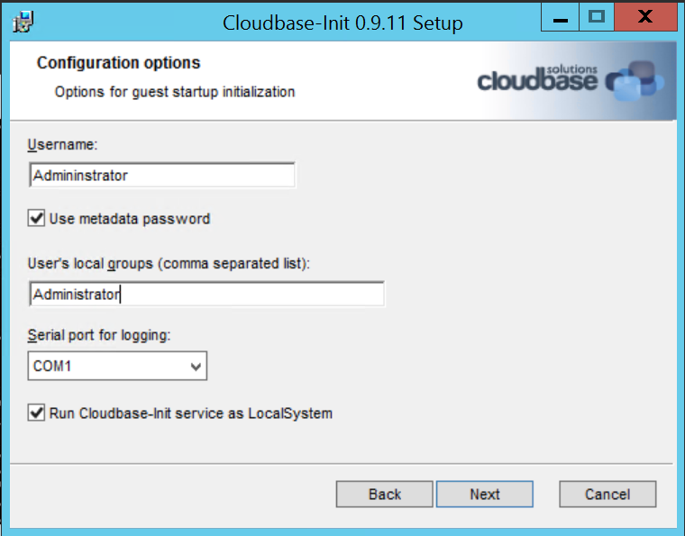
- Bước 8: Khi cài xong chọn Run Sysprep rồi shutdown, sau khi shutdown thì ssh lại KVM thực hiện nén file
  - virt-sparsify --compress ws2012.qcow2 ws2012_manual.qcow2
- Bước 9: Nén xong thì upload lên Glance là hoàn thành
 
